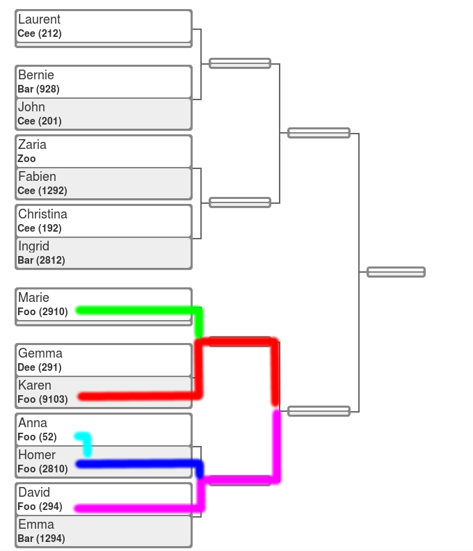

# Brackets generation tool

Under [MIT License](LICENSE)

The bracketool library allows you to generate brackets
for competitions, with [seeding](https://en.wikipedia.org/wiki/Seed_(sports)
and taking into account same team competitors.

## A **slot**, a **clash**, and **bye**

A competitor **slot** contains the following info:

- Competitor Name
- Team
- Ranking


Every **clash** has two slots. But a slot can also by filled
with a **bye**, that is a 'no compete' slot (so


## Same team competitors

In some competitive events (like martial arts, for example), it can happen
that a given team has several competitors in the same category. If teams
are not taken into account, it can happen that those are placed in near
slots, and they have to face each other in the first rounds:



But taking into account the teams, those competitors can be placed as far
as possible, reducing the chances of having clashes of same team members:


## Seeding

Seeding allows to also make strong competitors (those ones with a higher
rating) to face each other in later rounds.

This is how brackets would look without taking into account seeding:


And this would be a better bracket generation to make the highest ranked
competitor as far as possible.


# Installation

```
pip install bracketool
```

# Examples

**TODO**


# Implementation structure

## domain.py

Contains the basic data structures for the logic.

- Competitor: Basics information for a participant in
    a championship, competition, league, etc..

- Clash: representation of a clash

- ClashGenerator: defines a basic interface to
    clash generators


## brackets.py

Contains the basic logic to deal with brackets:

- generate clashes with assigned `byes`
- functions to compute minimum number of clashes to
    get to the final, and the distance in clasehes
    between to classes.


## teambrackets.py

Used to reseve spots in brackets for members of the same
team.


## Reference links


References about different kind of bracket generations:

- [Single Elimination Tournament](https://en.wikipedia.org/wiki/Single-elimination_tournament)
- [Double Elimination Tournament](https://en.wikipedia.org/wiki/Double-elimination_tournament)
- [Round Robin tournament](https://en.wikipedia.org/wiki/Round-robin_tournament)
- [Seed (sports)](https://en.wikipedia.org/wiki/Seed_(sports)

- [Tournament knockout](https://en.wikipedia.org/wiki/Tournament#Knockout)
